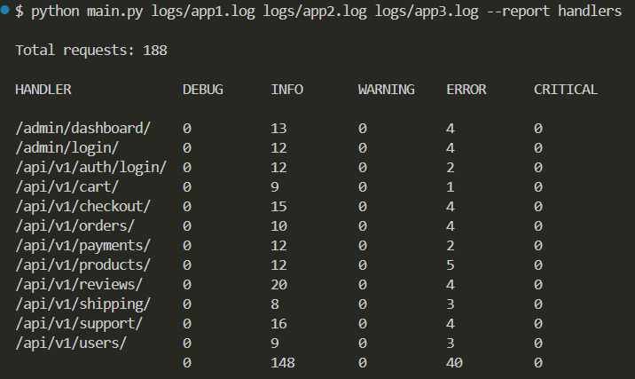

# Log Analyzer

Простой анализатор логов, позволяющий генерировать отчёты по переданным log-файлам. Расширяемая архитектура позволяет легко добавлять новые типы отчётов.

## Как использовать

```bash
python main.py path/to/log1.log path/to/log2.log --report handlers
```

## Требования

- Python 3.12

- `pytest` и `pytest-cov` (для тестов)

```

## Как добавить новый отчёт

Чтобы добавить новый тип отчёта, выполните следующие шаги:

1. **Создайте коллектор**
    В `reports/collectors.py` создайте класс, унаследованный от `BaseReportCollector`. Реализуйте методы `_process_file()` и `_aggregate_data()`.

2. **Создайте dataclass**
    В `reports/reports.py` создайте dataclass, унаследованный от `BaseReport`, для хранения данных отчёта.

3. **Создайте форматтер**
    В `reports/formatters.py` добавьте функцию форматирования нового отчёта, принимающую ваш dataclass и возвращающую строку.

4. **Зарегистрируйте отчёт**
    В `reports/report_registry.py` добавьте новый `Report`, указав класс коллектора и функцию форматтера. Обновите словарь `REPORTS`.

5. **Готово!**
    Запускайте `main.py` с новым именем отчёта: `--report your_report_name`.


## Тестирование

Для запуска тестов:

```bash
pytest --cov=log_analyzer
```

## Пример результата

Ниже пример вывода отчёта в консоль:


